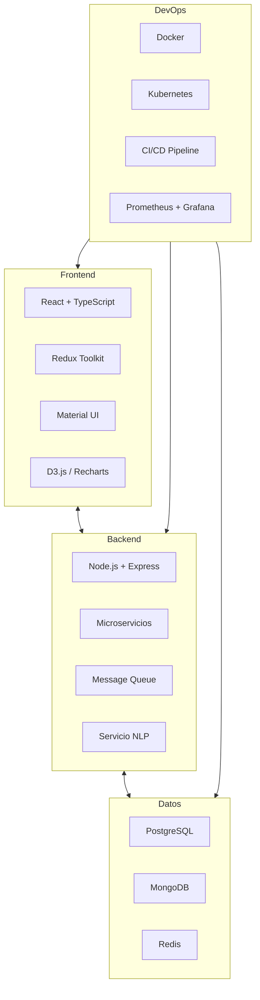
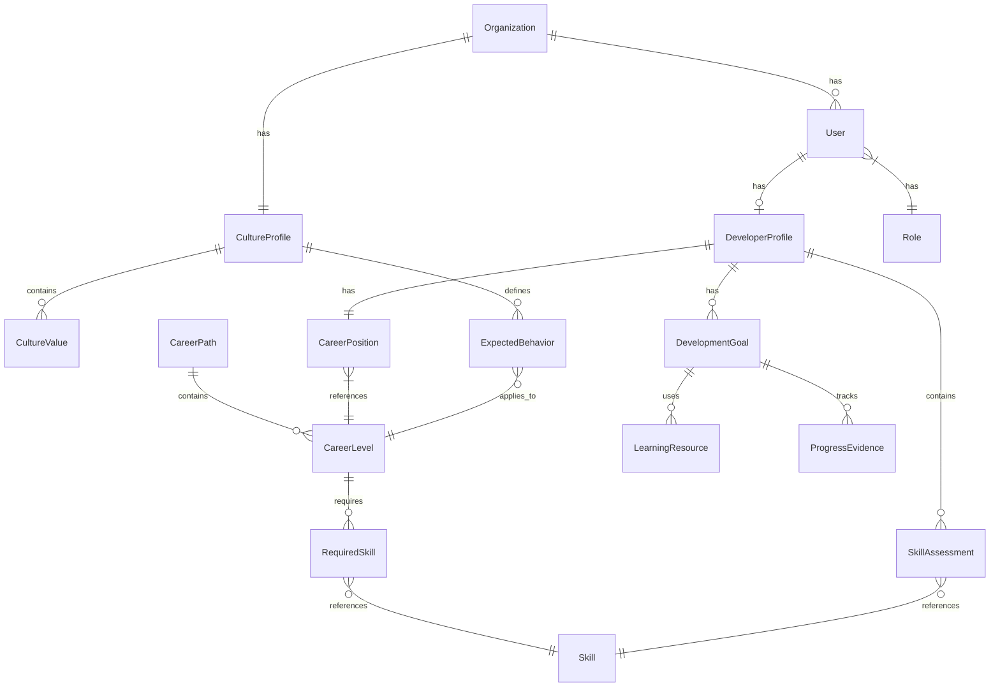
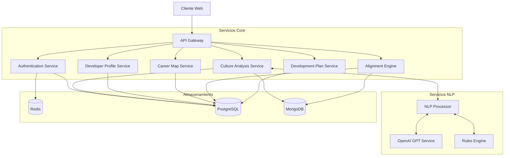
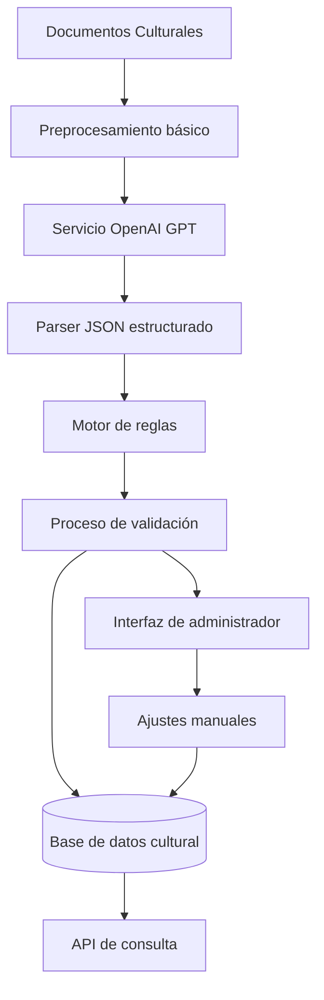
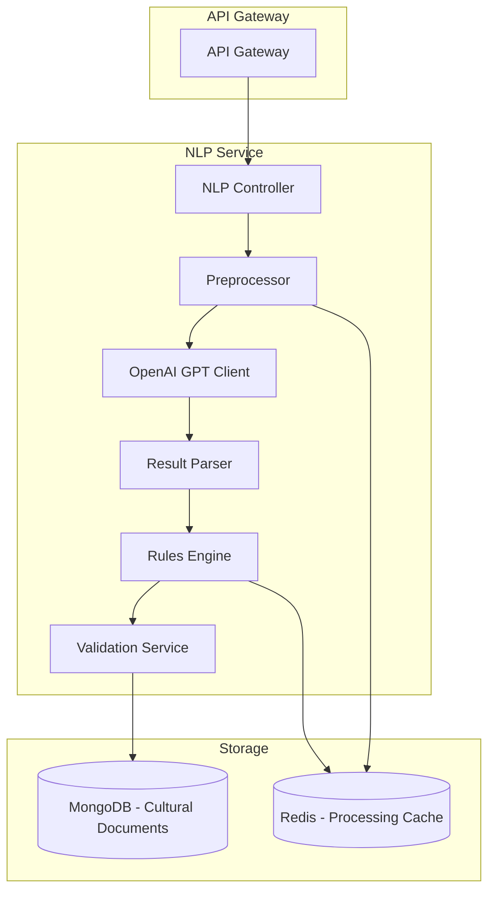
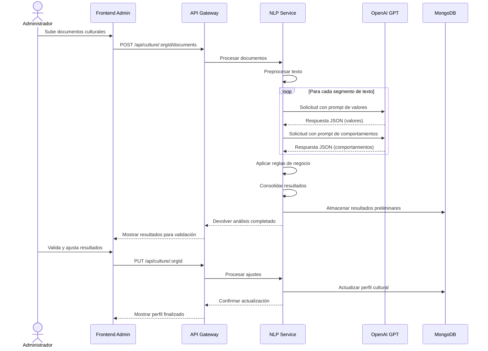

# DevCompass: Parte II - Especificación Técnica (Arquitectura)


*"Navegando tu carrera en el ecosistema de tu empresa"*

---

## Índice Parte II
1. [Visión General Técnica](#visión-general-técnica)
2. [Modelo de Datos](#modelo-de-datos)
3. [Arquitectura del Sistema](#arquitectura-del-sistema)
4. [Componentes Técnicos de NLP](#componentes-técnicos-de-nlp)

---

## Visión General Técnica

DevCompass se construirá como una aplicación web moderna basada en microservicios, con una clara separación entre frontend y backend. La aplicación utilizará tecnologías cloud-native y seguirá principios de desarrollo ágil.

### Stack Tecnológico Principal



## Modelo de Datos

El modelo de datos de DevCompass está diseñado para soportar el contexto organizacional, perfiles culturales, mapas de carrera y planes de desarrollo individuales.

### Diagrama Entidad-Relación



### Entidades Principales

#### Organization
```json
{
  "id": "string (UUID)",
  "name": "string",
  "domain": "string (dominio de correo)",
  "created_at": "timestamp",
  "active": "boolean"
}
```

#### CultureProfile
```json
{
  "id": "string (UUID)",
  "organization_id": "string (UUID, FK)",
  "raw_documents": "jsonb (documentos originales)",
  "last_processed": "timestamp",
  "processing_confidence": "float",
  "created_at": "timestamp",
  "updated_at": "timestamp"
}
```

#### User
```json
{
  "id": "string (UUID)",
  "email": "string",
  "name": "string",
  "google_id": "string",
  "profile_picture": "string (URL)",
  "last_login": "timestamp",
  "organization_id": "string (UUID, FK)",
  "role_id": "string (UUID, FK)"
}
```

#### DeveloperProfile
```json
{
  "id": "string (UUID)",
  "user_id": "string (UUID, FK)",
  "last_assessment": "timestamp",
  "career_goals": "json",
  "created_at": "timestamp",
  "updated_at": "timestamp"
}
```

#### CareerLevel
```json
{
  "id": "string (UUID)",
  "career_path_id": "string (UUID, FK)",
  "name": "string (ej: Junior, Mid, Senior)",
  "description": "string",
  "level_order": "integer",
  "progression_criteria": "json"
}
```

### Estrategia de Persistencia

- **PostgreSQL**: Almacenamiento principal para datos relacionales y transaccionales
- **MongoDB**: Para documentos semiestructurados (perfiles culturales, evidencias)
- **Redis**: Caché, sesiones y datos de alta frecuencia de acceso

## Arquitectura del Sistema

DevCompass utiliza una arquitectura de microservicios para permitir desarrollo, despliegue y escalado independientes de cada componente funcional.

### Diagrama de Arquitectura



### Descripción de Componentes Principales

1. **API Gateway**
   - Enrutamiento de solicitudes
   - Autenticación y autorización
   - Rate limiting y seguridad
   - Gestión de versiones de API

2. **Authentication Service**
   - Integración con Google OAuth
   - Gestión de sesiones y tokens
   - Autorización basada en roles

3. **Culture Analysis Service**
   - Gestión de documentos culturales
   - Coordinación con servicio NLP
   - Almacenamiento y consulta de perfiles culturales

4. **Developer Profile Service**
   - Gestión de perfiles técnicos
   - Evaluaciones de competencias
   - Historial de progresión

5. **Career Map Service**
   - Definición de rutas de carrera
   - Gestión de niveles y requisitos
   - Posicionamiento en mapa de carrera

6. **Alignment Engine**
   - Cálculo de alineación cultural-técnica
   - Identificación de brechas
   - Priorización de áreas de desarrollo

7. **Development Plan Service**
   - Generación de planes personalizados
   - Recomendación de recursos
   - Seguimiento de progreso

## Componentes Técnicos de NLP

El servicio NLP para el MVP se implementará con un enfoque híbrido que combina OpenAI GPT API con un sistema de reglas personalizadas, ofreciendo el mejor balance entre velocidad de implementación, precisión y flexibilidad.

### Estrategia NLP para MVP Mínimo



### Arquitectura del Servicio NLP



### Componentes Principales

1. **Preprocessor**
   - Extracción de texto de diferentes formatos (PDF, DOCX, HTML)
   - Limpieza básica y normalización
   - Segmentación en bloques procesables
   - Detección de idioma

2. **OpenAI GPT Client**
   - Gestión de prompts optimizados
   - Control de tokens y costos
   - Manejo de reintentos y errores
   - Paralelización de solicitudes

3. **Result Parser**
   - Validación de JSON retornado
   - Normalización de términos
   - Detección de inconsistencias
   - Consolidación de respuestas

4. **Rules Engine**
   - Jerarquización de valores
   - Mapeo de comportamientos a niveles
   - Eliminación de duplicados
   - Enriquecimiento semántico

5. **Validation Service**
   - Interfaz para revisión humana
   - Opciones de edición y ajuste
   - Confirmación de resultados
   - Publicación de perfil finalizado

### Ejemplos de Prompts GPT

#### Prompt para Extracción de Valores

```
Analiza el siguiente texto de cultura organizacional y extrae los 5-10 valores fundamentales de la empresa. Para cada valor, proporciona:
1. Nombre del valor (una palabra o frase corta)
2. Descripción breve que contextualiza el valor
3. Nivel de importancia percibida (del 1-10)
4. Términos o conceptos relacionados

Responde ÚNICAMENTE en formato JSON estructurado siguiendo exactamente este esquema:
{
  "valores": [
    {
      "nombre": "nombre del valor",
      "descripcion": "descripción breve",
      "importancia": número del 1-10,
      "terminosRelacionados": ["término1", "término2"]
    }
  ]
}

Texto a analizar:
[TEXTO CULTURAL DE LA EMPRESA]
```

#### Prompt para Comportamientos Esperados

```
Analiza el siguiente texto de cultura organizacional y extrae los comportamientos específicos que la empresa espera de sus empleados. Para cada comportamiento:
1. Descripción clara del comportamiento
2. Valores asociados a este comportamiento
3. Niveles jerárquicos a los que aplica (Junior, Mid, Senior, Lead)

Responde ÚNICAMENTE en formato JSON estructurado siguiendo exactamente este esquema:
{
  "comportamientos": [
    {
      "descripcion": "descripción del comportamiento",
      "valoresAsociados": ["valor1", "valor2"],
      "nivelesAplicables": ["Junior", "Mid", "Senior", "Lead"]
    }
  ]
}

Texto a analizar:
[TEXTO CULTURAL DE LA EMPRESA]
```

### Flujo de Procesamiento Completo



### Métricas de Rendimiento Objetivo

- **Tiempo de procesamiento**: < 2 minutos para documentos típicos (hasta 50 páginas)
- **Precisión en valores**: > 85% de valores culturales correctamente identificados
- **Precisión en comportamientos**: > 80% de comportamientos correctamente asociados
- **Satisfacción de usuario**: > 4/5 en relevancia de los resultados extraídos
- **Tasa de ajustes manuales**: < 30% de elementos requieren modificación manual