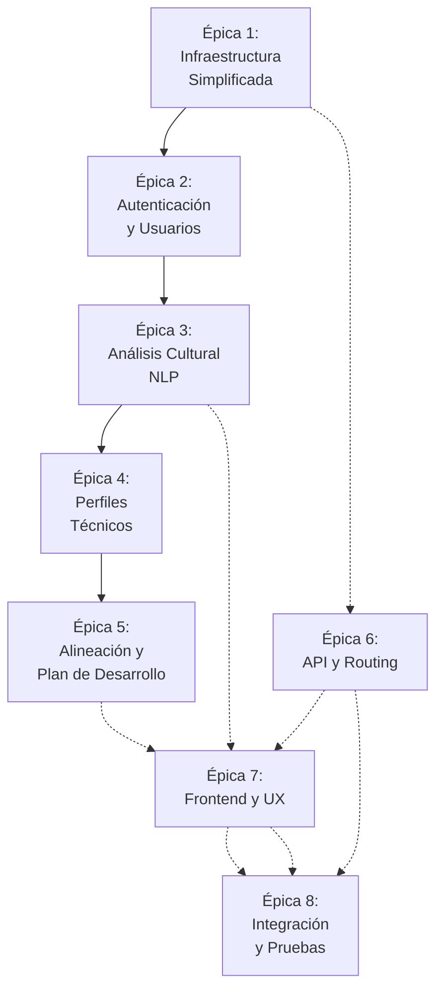
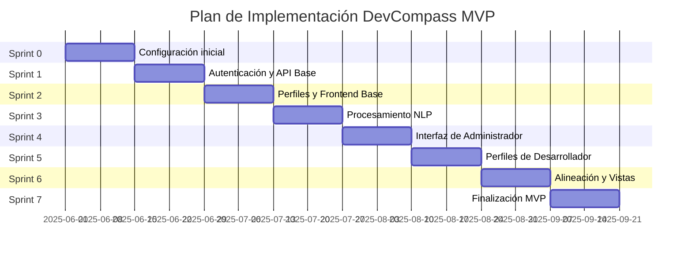

# DevCompass: Parte IV - Tickets de Trabajo para MVP

*"Navegando tu carrera en el ecosistema de tu empresa"*

---

## Índice Parte IV
1. [Backlog de Tickets](#backlog-de-tickets)
2. [Épicas y Sprints](#épicas-y-sprints)
3. [Detalles de Tickets por Épica](#detalles-de-tickets-por-épica)
4. [Planificación de Sprints](#planificación-de-sprints)
5. [Estimación de Recursos](#estimación-de-recursos)

---

## Backlog de Tickets

El backlog de tickets para el MVP de DevCompass está organizado en épicas que representan los componentes principales del sistema. Se ha priorizado las funcionalidades esenciales con una infraestructura simplificada para optimizar el tiempo de desarrollo y validación.

### Visión General de Épicas

### Resumen de Tickets por Épica

| Épica | Tickets | Puntos Totales | Prioridad |
|-------|---------|----------------|-----------|
| 1. Infraestructura Simplificada | 4 | 19 | Alta |
| 2. Autenticación y Usuarios | 3 | 18 | Alta |
| 3. Análisis Cultural (NLP) | 4 | 37 | Alta |
| 4. Perfiles Técnicos | 3 | 21 | Alta |
| 5. Alineación y Plan de Desarrollo | 3 | 29 | Alta |
| 6. API y Routing | 4 | 20 | Alta |
| 7. Frontend y UX | 4 | 29 | Alta |
| 8. Integración y Pruebas | 3 | 16 | Alta |
| **Total** | **28** | **175** | |

## Épicas y Sprints

La planificación del desarrollo está estructurada en 8 sprints de 2 semanas cada uno, comenzando con un Sprint 0 para preparación.

## Detalles de Tickets por Épica

### Épica 1: Configuración de Proyecto e Infraestructura Simplificada

#### DCM-001: Configuración del repositorio y estructura de proyecto
**Tipo**: Tarea Técnica  
**Prioridad**: Alta  
**Estimación**: 3 puntos  
**Descripción**: Crear repositorio en GitHub/GitLab y configurar estructura de carpetas básica para el proyecto.  
**Criterios de aceptación**:
- Repositorio creado con estructura de carpetas
- Configuración de ESLint, Prettier y TypeScript
- Inicialización de proyecto con React (frontend) y Express (backend)
- README con instrucciones de instalación y desarrollo

#### DCM-002: Configuración de entorno de desarrollo simple
**Tipo**: Tarea Técnica  
**Prioridad**: Alta  
**Estimación**: 3 puntos  
**Descripción**: Configurar un entorno de desarrollo simple con Docker para facilitar el desarrollo local.  
**Criterios de aceptación**:
- Docker Compose para el entorno de desarrollo
- Contenedores para base de datos (PostgreSQL)
- Scripts para iniciar el entorno completo
- Variables de entorno configuradas para desarrollo

#### DCM-003: Implementación del modelo de datos inicial
**Tipo**: Tarea Técnica  
**Prioridad**: Alta  
**Estimación**: 8 puntos  
**Descripción**: Implementar el esquema de base de datos inicial con las entidades principales requeridas para el MVP.  
**Criterios de aceptación**:
- Esquemas de PostgreSQL para entidades principales (User, Organization, CultureProfile, etc.)
- Migraciones de base de datos
- Scripts de inicialización para datos de prueba
- Configuración de Knex.js/Prisma/Sequelize para ORM

#### DCM-004: Configuración de despliegue simple
**Tipo**: Tarea Técnica  
**Prioridad**: Media  
**Estimación**: 5 puntos  
**Descripción**: Configurar un proceso de despliegue simple para el MVP en un proveedor de hosting accesible.  
**Criterios de aceptación**:
- Configuración para despliegue en Heroku, Vercel, o proveedor similar
- Scripts de despliegue automatizado
- Configuración de variables de entorno para producción
- Documentación del proceso de despliegue

---

### Épica 2: Autenticación y Gestión de Usuarios

#### DCM-005: Implementación de autenticación con Google OAuth
**Tipo**: Historia de Usuario  
**Prioridad**: Alta  
**Estimación**: 8 puntos  
**Descripción**: Como usuario, quiero poder iniciar sesión con mi cuenta de Google para acceder a la plataforma de manera segura y sin tener que crear credenciales adicionales.  
**Criterios de aceptación**:
- Flujo completo de login con Google OAuth 2.0
- Redirección a callback y procesamiento de tokens
- Generación y validación de JWT
- Manejo de sesiones
- UI para botón de login con Google

#### DCM-006: Implementación de roles de usuario (Admin/Developer)
**Tipo**: Historia de Usuario  
**Prioridad**: Alta  
**Estimación**: 5 puntos  
**Descripción**: Como sistema, necesito distinguir entre usuarios administradores y desarrolladores para proporcionar acceso diferenciado a las funcionalidades.  
**Criterios de aceptación**:
- Detección automática de rol basado en dominio de correo y primer usuario
- Middleware de autorización basado en roles
- Limitación de acceso a endpoints según rol
- Interfaz de usuario adaptada al rol del usuario

#### DCM-007: Perfil de usuario y gestión de cuenta
**Tipo**: Historia de Usuario  
**Prioridad**: Media  
**Estimación**: 5 puntos  
**Descripción**: Como usuario, quiero poder ver y editar mi información de perfil básica.  
**Criterios de aceptación**:
- Página de perfil de usuario con información de Google
- Capacidad para actualizar información complementaria
- Opción para cerrar sesión
- Visualización del rol actual

---

### Épica 3: Módulo de Análisis Cultural (NLP)

#### DCM-008: Servicio de procesamiento NLP con OpenAI GPT
**Tipo**: Tarea Técnica  
**Prioridad**: Alta  
**Estimación**: 13 puntos  
**Descripción**: Implementar el servicio de NLP para el análisis de documentos culturales utilizando OpenAI GPT API.  
**Criterios de aceptación**:
- Cliente para comunicación con OpenAI API
- Implementación de prompts optimizados para extracción de valores y comportamientos
- Manejo de reintentos y errores
- Control de costos y límites de tokens
- Pruebas unitarias con casos de texto real

#### DCM-009: Preprocesamiento de documentos culturales
**Tipo**: Tarea Técnica  
**Prioridad**: Alta  
**Estimación**: 8 puntos  
**Descripción**: Implementar la capa de preprocesamiento para documentos culturales en diferentes formatos.  
**Criterios de aceptación**:
- Extracción de texto de documentos PDF, DOCX y HTML
- Limpieza y normalización de texto
- Segmentación para procesamiento modular
- Detección de idioma

#### DCM-010: Motor de reglas para post-procesamiento de resultados NLP
**Tipo**: Tarea Técnica  
**Prioridad**: Alta  
**Estimación**: 8 puntos  
**Descripción**: Implementar el motor de reglas para procesar y estructurar los resultados obtenidos del análisis NLP.  
**Criterios de aceptación**:
- Jerarquización de valores culturales
- Mapeo de comportamientos a niveles de carrera
- Eliminación de duplicados y fusión de conceptos similares
- Persistencia de resultados en la base de datos

#### DCM-011: Interfaz de administrador para gestión cultural
**Tipo**: Historia de Usuario  
**Prioridad**: Alta  
**Estimación**: 8 puntos  
**Descripción**: Como administrador, quiero poder subir documentos culturales, iniciar el procesamiento y visualizar/validar los resultados.  
**Criterios de aceptación**:
- Interfaz para carga de documentos (drag & drop)
- Botón para iniciar procesamiento con indicador de progreso
- Visualización de valores y comportamientos extraídos
- Interfaz para editar, eliminar o ajustar resultados

---

### Épica 4: Evaluación de Perfiles Técnicos

#### DCM-012: Implementación de autodiagnóstico para desarrolladores
**Tipo**: Historia de Usuario  
**Prioridad**: Alta  
**Estimación**: 8 puntos  
**Descripción**: Como desarrollador, quiero poder completar una evaluación de mis competencias técnicas y blandas para obtener mi perfil profesional.  
**Criterios de aceptación**:
- Formulario de evaluación con categorías relevantes
- Evaluación de habilidades técnicas por nivel
- Evaluación de habilidades blandas
- Guardado parcial y continuación posterior
- Visualización de resultados

#### DCM-013: Calibración de nivel técnico
**Tipo**: Historia de Usuario  
**Prioridad**: Media  
**Estimación**: 5 puntos  
**Descripción**: Como sistema, necesito asignar un nivel técnico al desarrollador basado en su autoevaluación.  
**Criterios de aceptación**:
- Algoritmo de calibración basado en respuestas
- Asignación de nivel (Junior/Mid/Senior/Tech Lead)
- Opción para validación por líder técnico
- Persistencia del nivel asignado

#### DCM-014: Implementación del mapa de carrera básico
**Tipo**: Historia de Usuario  
**Prioridad**: Alta  
**Estimación**: 8 puntos  
**Descripción**: Como desarrollador, quiero visualizar el mapa de carrera de mi organización con mi posición actual y próximos pasos.  
**Criterios de aceptación**:
- Visualización gráfica del path de carrera
- Indicación clara de posición actual
- Detalle de requisitos por nivel
- Relación visual con cultura organizacional

---

### Épica 5: Motor de Alineación y Plan de Desarrollo

#### DCM-015: Implementación del motor de alineación cultural-técnica
**Tipo**: Tarea Técnica  
**Prioridad**: Alta  
**Estimación**: 13 puntos  
**Descripción**: Implementar el algoritmo que analiza la alineación entre el perfil técnico del desarrollador y el perfil cultural de la organización.  
**Criterios de aceptación**:
- Cálculo de métricas de alineación por dimensión
- Identificación de brechas prioritarias
- Algoritmo de puntuación ponderada
- Persistencia de resultados de alineación
- Pruebas con casos reales

#### DCM-016: Dashboard de alineación para desarrolladores
**Tipo**: Historia de Usuario  
**Prioridad**: Alta  
**Estimación**: 8 puntos  
**Descripción**: Como desarrollador, quiero visualizar mi nivel de alineación con la cultura organizacional para entender mis fortalezas y áreas de mejora.  
**Criterios de aceptación**:
- Dashboard visual con métricas de alineación
- Gráficos de distribución por dimensión
- Listado de brechas prioritarias
- Recomendaciones generales basadas en alineación

#### DCM-017: Generación de plan de desarrollo personalizado
**Tipo**: Historia de Usuario  
**Prioridad**: Alta  
**Estimación**: 8 puntos  
**Descripción**: Como desarrollador, quiero recibir un plan de desarrollo personalizado basado en mi alineación cultural-técnica.  
**Criterios de aceptación**:
- Roadmap visual con objetivos prioritarios
- Tiempos estimados para cada objetivo
- Recomendación inicial de recursos
- Opción para ajustar o personalizar el plan

---

### Épica 6: API y Routing

#### DCM-018: Implementación de estructura de API básica
**Tipo**: Tarea Técnica  
**Prioridad**: Alta  
**Estimación**: 5 puntos  
**Descripción**: Implementar la estructura básica de API con Express.js para los diferentes módulos funcionales.  
**Criterios de aceptación**:
- Configuración de Express.js con middleware esenciales
- Estructura de rutas por dominio funcional
- Middleware de autenticación y autorización
- Documentación básica de endpoints

#### DCM-019: Implementación de endpoints para gestión cultural
**Tipo**: Tarea Técnica  
**Prioridad**: Alta  
**Estimación**: 5 puntos  
**Descripción**: Implementar los endpoints REST para la gestión de perfiles culturales.  
**Criterios de aceptación**:
- Endpoints para CRUD de perfiles culturales
- Endpoint para carga de documentos
- Endpoint para iniciar procesamiento
- Endpoints para consulta de valores y comportamientos

#### DCM-020: Implementación de endpoints para perfiles y evaluación
**Tipo**: Tarea Técnica  
**Prioridad**: Alta  
**Estimación**: 5 puntos  
**Descripción**: Implementar los endpoints REST para la gestión de perfiles de desarrollador y evaluaciones.  
**Criterios de aceptación**:
- Endpoints para CRUD de perfiles
- Endpoints para gestión de evaluaciones
- Endpoint para consulta de nivel técnico
- Validaciones de datos

#### DCM-021: Implementación de endpoints para alineación y planes
**Tipo**: Tarea Técnica  
**Prioridad**: Alta  
**Estimación**: 5 puntos  
**Descripción**: Implementar los endpoints REST para el cálculo de alineación y generación de planes.  
**Criterios de aceptación**:
- Endpoint para cálculo de alineación
- Endpoint para consulta de brechas
- Endpoint para generación de plan de desarrollo
- Formato de respuesta consistente

---

### Épica 7: Frontend y Experiencia de Usuario

#### DCM-022: Implementación de componentes compartidos
**Tipo**: Tarea Técnica  
**Prioridad**: Alta  
**Estimación**: 5 puntos  
**Descripción**: Desarrollar los componentes compartidos de UI que se utilizarán en toda la aplicación.  
**Criterios de aceptación**:
- Navbar y sidebar responsivos
- Componentes de formulario reutilizables
- Componentes de visualización de datos
- Tema y estilos unificados

#### DCM-023: Implementación de vistas de administrador
**Tipo**: Historia de Usuario  
**Prioridad**: Alta  
**Estimación**: 8 puntos  
**Descripción**: Como administrador, quiero acceder a un dashboard que me permita gestionar el perfil cultural y usuarios de mi organización.  
**Criterios de aceptación**:
- Dashboard principal con métricas
- Vista de gestión cultural
- Vista de gestión de usuarios
- Editor de mapa de carrera organizacional

#### DCM-024: Implementación de vistas de desarrollador
**Tipo**: Historia de Usuario  
**Prioridad**: Alta  
**Estimación**: 8 puntos  
**Descripción**: Como desarrollador, quiero acceder a un dashboard que me muestre mi perfil, posición actual y plan de desarrollo.  
**Criterios de aceptación**:
- Dashboard personal con indicadores clave
- Vista de autodiagnóstico
- Visualización de mapa de carrera
- Plan de desarrollo interactivo

#### DCM-025: Visualizaciones de datos con D3.js/Recharts
**Tipo**: Tarea Técnica  
**Prioridad**: Media  
**Estimación**: 8 puntos  
**Descripción**: Implementar visualizaciones para perfiles culturales, mapas de carrera y métricas de alineación.  
**Criterios de aceptación**:
- Gráfico radar para perfil de competencias
- Visualización de mapa de calor para alineación
- Gráfico de progresión para plan de desarrollo
- Interactividad y responsividad

---

### Épica 8: Integración y Pruebas

#### DCM-026: Integración de componentes front-end y back-end
**Tipo**: Tarea Técnica  
**Prioridad**: Alta  
**Estimación**: 8 puntos  
**Descripción**: Integrar todos los componentes front-end con los servicios back-end correspondientes.  
**Criterios de aceptación**:
- Comunicación correcta entre frontend y API
- Manejo de errores y estados de carga
- Estado global configurado con Redux
- Pruebas de integración básicas

#### DCM-027: Pruebas del flujo principal
**Tipo**: Tarea Técnica  
**Prioridad**: Alta  
**Estimación**: 5 puntos  
**Descripción**: Implementar y ejecutar pruebas para validar el flujo completo del MVP.  
**Criterios de aceptación**:
- Pruebas del flujo de autenticación
- Pruebas del flujo de análisis cultural
- Pruebas del flujo de evaluación de desarrollador
- Pruebas del flujo de generación de plan de desarrollo

#### DCM-028: Despliegue de MVP en ambiente de producción
**Tipo**: Tarea Técnica  
**Prioridad**: Alta  
**Estimación**: 3 puntos  
**Descripción**: Desplegar la versión MVP en el ambiente de producción seleccionado.  
**Criterios de aceptación**:
- Aplicación funcionando correctamente en producción
- Configuración de dominio
- Monitoreo básico configurado
- Plan de recopilación de feedback

## Planificación de Sprints

### Sprint 0: Preparación (2 semanas)
- DCM-001: Configuración del repositorio y estructura de proyecto
- DCM-002: Configuración de entorno de desarrollo simple
- DCM-003: Implementación del modelo de datos inicial

### Sprint 1: Autenticación y API Base (2 semanas)
- DCM-004: Configuración de despliegue simple
- DCM-005: Implementación de autenticación con Google OAuth
- DCM-006: Implementación de roles de usuario
- DCM-018: Implementación de estructura de API básica

### Sprint 2: Perfiles y Frontend Base (2 semanas)
- DCM-007: Perfil de usuario y gestión de cuenta
- DCM-019: Implementación de endpoints para gestión cultural
- DCM-020: Implementación de endpoints para perfiles y evaluación
- DCM-022: Implementación de componentes compartidos

### Sprint 3: Procesamiento NLP (2 semanas)
- DCM-008: Servicio de procesamiento NLP con OpenAI GPT
- DCM-009: Preprocesamiento de documentos culturales
- DCM-010: Motor de reglas para post-procesamiento

### Sprint 4: Interfaz de Administrador (2 semanas)
- DCM-011: Interfaz de administrador para gestión cultural
- DCM-023: Implementación de vistas de administrador
- DCM-025: Visualizaciones de datos (parte 1)

### Sprint 5: Perfiles de Desarrollador (2 semanas)
- DCM-012: Implementación de autodiagnóstico
- DCM-013: Calibración de nivel técnico
- DCM-014: Implementación del mapa de carrera básico

### Sprint 6: Alineación y Plan (2 semanas)
- DCM-015: Implementación del motor de alineación
- DCM-016: Dashboard de alineación
- DCM-021: Implementación de endpoints para alineación y planes
- DCM-024: Implementación de vistas de desarrollador

### Sprint 7: Finalización MVP (2 semanas)
- DCM-017: Generación de plan de desarrollo personalizado
- DCM-025: Visualizaciones de datos (parte 2)
- DCM-026: Integración de componentes
- DCM-027: Pruebas del flujo principal
- DCM-028: Despliegue de MVP en producción

## Estimación de Recursos

### Equipo Recomendado

- **1 x Tech Lead / Arquitecto**: Responsable de la arquitectura general, decisiones técnicas y supervisión del desarrollo
- **2 x Desarrolladores Full Stack**: Responsables de la implementación frontend y backend
- **1 x Especialista en NLP**: Responsable del componente de procesamiento de lenguaje natural
- **1 x UX/UI Designer**: Responsable del diseño de interfaces y experiencia de usuario

### Estimación Temporal

- **Total de tickets**: 28
- **Puntos de historia totales**: 175
- **Duración estimada**: 14 semanas (7 sprints de 2 semanas + Sprint 0)
- **Fecha estimada de finalización**: Septiembre 2025 (asumiendo inicio en Junio 2025)

### Dependencias Externas

- **OpenAI API**: Para procesamiento NLP
- **Google OAuth**: Para autenticación
- **Proveedor de Hosting**: Para despliegue (Heroku, Vercel, etc.)
- **Base de Datos**: PostgreSQL gestionado

---

© 2025 DevCompass | *"Navegando tu carrera en el ecosistema de tu empresa"*